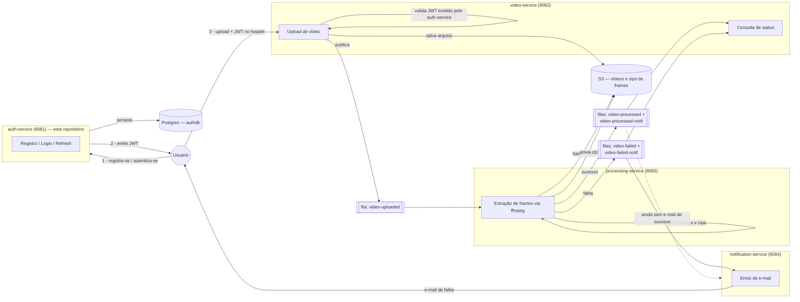
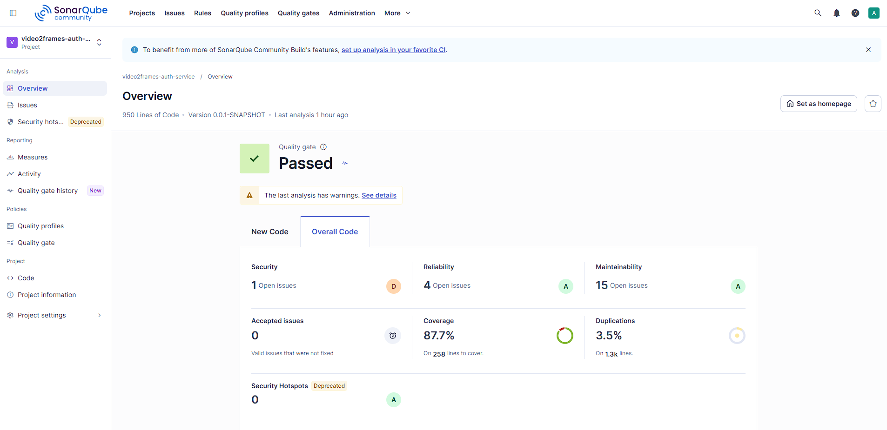

# video2frames-auth-service

Projeto Pós-Tech Fase 05 - Microserviço para autenticação e controle de usuários

## Visão geral

O `auth-service` é o microserviço responsável por **cadastro de usuários, login e emissão/renovação de tokens JWT** dentro do sistema **Video2Frames** — um pipeline que recebe upload de vídeos, extrai frames via `ffmpeg` e notifica o usuário ao final do processamento.

Este serviço não participa do pipeline de processamento em si (não acessa S3, SQS ou fila alguma). Seu único papel é autenticar usuários e emitir os JWTs (assinados com HS256, segredo compartilhado) que o `video-service` valida para proteger sua API de upload.

Arquitetura interna em **hexagonal (ports & adapters)**, com três camadas:
- `domain` — entidades e regras de negócio puras (`User`, `RefreshToken`), sem dependência de framework.
- `application` — casos de uso (`RegisterUserUseCase`, `LoginUseCase`, `RefreshTokenUseCase`) e ports (`PasswordHasher`, `TokenGenerator`, `TokenHasher`).
- `infrastructure` — adapters concretos: REST (`AuthController`), persistência JPA/Postgres, segurança (Spring Security + JJWT).

## Papel no pipeline Video2Frames

O sistema completo é composto por 4 microserviços independentes, cada um em seu próprio repositório, comunicando-se via REST e filas SQS:



> O `auth-service` não troca mensagens com S3/SQS: sua única interface com o resto do sistema é emitir/validar os JWTs consumidos pelo `video-service`.

### Arquitetura interna (hexagonal)

```mermaid
flowchart TB
    subgraph Infra["infrastructure"]
        Ctrl[AuthController<br/>POST /api/auth/register|login|refresh]
        Filter[JwtAuthenticationFilter]
        SecConf[SecurityConfig]
        JwtGen[JwtTokenGenerator<br/>implements TokenGenerator]
        BCrypt[BCryptPasswordHasher<br/>implements PasswordHasher]
        Sha[Sha256TokenHasher<br/>implements TokenHasher]
        UserAdapter[UserRepositoryAdapter]
        RefreshAdapter[RefreshTokenRepositoryAdapter]
        JPA[(Postgres via Spring Data JPA<br/>+ Flyway migrations)]
    end

    subgraph App["application"]
        RegisterUC[RegisterUserUseCase]
        LoginUC[LoginUseCase]
        RefreshUC[RefreshTokenUseCase]
        Issuer[TokenIssuer]
        Ports{{"ports: PasswordHasher,\nTokenGenerator, TokenHasher"}}
    end

    subgraph Dom["domain"]
        UserModel[User]
        RefreshModel[RefreshToken]
        Repos{{"repositories: UserRepository,\nRefreshTokenRepository"}}
        Exc[InvalidCredentialsException /\nEmailAlreadyRegisteredException]
    end

    Ctrl --> RegisterUC
    Ctrl --> LoginUC
    Ctrl --> RefreshUC
    Filter --> JwtGen
    SecConf --> Filter

    RegisterUC --> UserModel
    RegisterUC --> Ports
    LoginUC --> UserModel
    LoginUC --> Ports
    LoginUC --> Issuer
    RefreshUC --> RefreshModel
    RefreshUC --> Issuer
    Issuer --> RefreshModel
    Issuer --> Ports

    RegisterUC -.impl.-> Repos
    LoginUC -.impl.-> Repos
    RefreshUC -.impl.-> Repos

    BCrypt -.implementa.-> Ports
    JwtGen -.implementa.-> Ports
    Sha -.implementa.-> Ports
    UserAdapter -.implementa.-> Repos
    RefreshAdapter -.implementa.-> Repos
    UserAdapter --> JPA
    RefreshAdapter --> JPA
```

**Fluxos principais:**
- **Registro** — `AuthController.register` → `RegisterUserUseCase` valida se o e-mail já existe (`EmailAlreadyRegisteredException` se sim), cria o `User` (senha com hash via `BCryptPasswordHasher`) e persiste.
- **Login** — `AuthController.login` → `LoginUseCase` busca o usuário por e-mail, valida a senha (`InvalidCredentialsException` se inválida) e delega ao `TokenIssuer` a emissão do par access/refresh token.
- **Refresh** — `AuthController.refresh` → `RefreshTokenUseCase` valida o refresh token opaco (hash comparado via `Sha256TokenHasher`), revoga o token usado (rotação) e emite um novo par via `TokenIssuer`.

## Endpoints

Base path: `/api/auth` (público, não exige JWT).

| Método | Caminho | Descrição | Corpo | Resposta |
|---|---|---|---|---|
| `POST` | `/api/auth/register` | Cadastra um novo usuário | `{ "email": "...", "password": "..." }` | `201 Created` |
| `POST` | `/api/auth/login` | Autentica e emite tokens | `{ "email": "...", "password": "..." }` | `200 OK` com `{ accessToken, refreshToken, expiresIn }` |
| `POST` | `/api/auth/refresh` | Renova o par de tokens (rotação) | `{ "refreshToken": "..." }` | `200 OK` com `{ accessToken, refreshToken, expiresIn }` |

Erros de negócio (credenciais inválidas, e-mail já cadastrado, validação de campos) são tratados pelo `GlobalExceptionHandler` e retornam `401`, `409` ou `400` respectivamente, com corpo `{ "message": "..." }`.

Endpoints do Actuator (`/actuator/health`, `/actuator/info`, `/actuator/prometheus`, `/actuator/metrics`) também são liberados sem autenticação — ver seção [Observabilidade](#observabilidade--monitoramento).

## Stack tecnológica

- **Java 17**
- **Spring Boot 4.1** (Web, Security, Data JPA, Validation, Actuator)
- **Spring Security** — filtro JWT stateless (`JwtAuthenticationFilter`) + BCrypt para hash de senha
- **PostgreSQL** + **Flyway** para versionamento de schema
- **JJWT (io.jsonwebtoken)** para geração/validação de JWT (HS256)
- **Lombok** — `@Slf4j` para logging
- **JUnit 5 + Mockito + AssertJ** para testes
- **Micrometer + Prometheus registry** para métricas
- **JaCoCo** para cobertura de testes
- **Docker / Docker Compose**

## Como rodar localmente

### Opção 1 — tudo em containers (recomendado)

```bash
docker compose up -d
```

Isso sobe o Postgres (`authdb`) e a própria aplicação (`auth-service`), já conectados entre si. O serviço fica disponível em `http://localhost:8081`.

### Opção 2 — só o banco em container, app rodando localmente

```bash
docker compose up authdb -d
./mvnw spring-boot:run
```

Útil durante o desenvolvimento, para ter hot-reload e debug direto na IDE, mantendo apenas o Postgres containerizado.

## Variáveis de ambiente

Todas têm valor padrão definido em `application.yml`, sobrescrevíveis via variável de ambiente:

| Variável | Padrão | Descrição |
|---|---|---|
| `DB_URL` | `jdbc:postgresql://localhost:5432/authdb` | URL JDBC do Postgres |
| `DB_USER` | `authdb` | Usuário do banco |
| `DB_PASSWORD` | `authdb` | Senha do banco |
| `SERVER_PORT` | `8081` | Porta HTTP da aplicação |
| `JWT_SECRET` | (chave de exemplo) | Segredo HS256 usado para assinar/validar os JWTs — **deve ser compartilhado com o `video-service`** |
| `JWT_ACCESS_EXPIRATION_MINUTES` | `15` | Tempo de expiração do access token |
| `JWT_REFRESH_EXPIRATION_DAYS` | `7` | Tempo de expiração do refresh token |
| `LOG_LEVEL_ROOT` | `INFO` | Nível de log raiz |
| `LOG_LEVEL` | `INFO` | Nível de log do pacote `br.com.video2frames` |
| `LOG_FORMAT` | *(vazio = texto)* | `ecs` habilita logging estruturado em JSON — ver [Logging](#logging) |

## Testes

Suíte com **58 testes unitários** (JUnit 5 + Mockito + AssertJ, convenção de nomes em português `metodo_quandoX_resultado`), cobrindo domínio, casos de uso e adapters de infraestrutura.

```bash
./mvnw test
```

O `jacoco-maven-plugin` já está configurado no `pom.xml` para gerar o relatório de cobertura em `target/site/jacoco/jacoco.xml` a cada execução da fase `test`. Cobertura atual: **87.7%** (ver seção [Qualidade de código](#qualidade-de-código-sonarqube)).

## Logging

O serviço usa o **logging estruturado nativo do Spring Boot 4** (sem dependências extras) para permitir alternar o formato de saída via variável de ambiente:

- `LOG_FORMAT` vazio (padrão) → logs em texto simples no console, ideais para desenvolvimento local.
- `LOG_FORMAT=ecs` → logs em **JSON no formato ECS** (Elastic Common Schema), prontos para ingestão direta em **AWS CloudWatch Logs Insights** ou em uma stack **ELK**, sem qualquer mudança de código — só a variável de ambiente muda entre dev e staging/produção.

Os casos de uso (`RegisterUserUseCase`, `LoginUseCase`, `RefreshTokenUseCase`, `TokenIssuer`), o `AuthController` e o `JwtAuthenticationFilter` registram:
- **INFO** para eventos de negócio relevantes (registro concluído, login bem-sucedido, tokens emitidos/renovados);
- **WARN** para falhas esperadas do domínio (credenciais inválidas, e-mail duplicado, refresh token inválido/expirado, JWT malformado) — não são tratadas como erro (`ERROR`) por não indicarem bug, e sim uso incorreto/tentativa maliciosa.

Nenhum log grava senha, hash de senha, JWT ou refresh token em texto — apenas identificadores não sensíveis (e-mail, id de usuário).

## Observabilidade / Monitoramento

O serviço expõe métricas e health checks via Spring Boot Actuator, liberados publicamente (sem autenticação) em `SecurityConfig`:

- `GET /actuator/health` — status de saúde da aplicação (inclui conectividade com o banco).
- `GET /actuator/prometheus` — métricas no formato Prometheus (via `micrometer-registry-prometheus`), incluindo métricas de JVM, HTTP e DataSource.
- `GET /actuator/info` e `GET /actuator/metrics` — informações gerais e listagem de métricas disponíveis.

Para visualização, o repositório irmão **`video2frames-infra-ops`** mantém um `docker-compose` com **Prometheus** (que faz *scrape* de `/actuator/prometheus` dos 4 microserviços via `host.docker.internal`) e **Grafana**, com um dashboard pré-provisionado ("Video2Frames - Overview") já pronto para uso — basta subir aquele stack separadamente para acompanhar as métricas deste serviço em tempo real.

## Qualidade de código (SonarQube)

Análise local executada com SonarQube, com **Quality Gate: Passed**:

| Métrica | Valor |
|---|---|
| Linhas de código | 950 |
| Cobertura | 87.7% |
| Bugs | 0 (Reliability rating A) |
| Vulnerabilidades | 1 (Security rating D) |
| Code Smells | 15 (Maintainability rating A) |
| Linhas duplicadas | 3.5% |



Para reproduzir a análise localmente (assumindo um SonarQube rodando em `http://localhost:9000`):

```bash
./mvnw test org.sonarsource.scanner.maven:sonar-maven-plugin:sonar -Dsonar.projectKey=video2frames-auth-service -Dsonar.host.url=http://localhost:9000 -Dsonar.token=<seu-token> -Dsonar.coverage.jacoco.xmlReportPaths=target/site/jacoco/jacoco.xml
```
